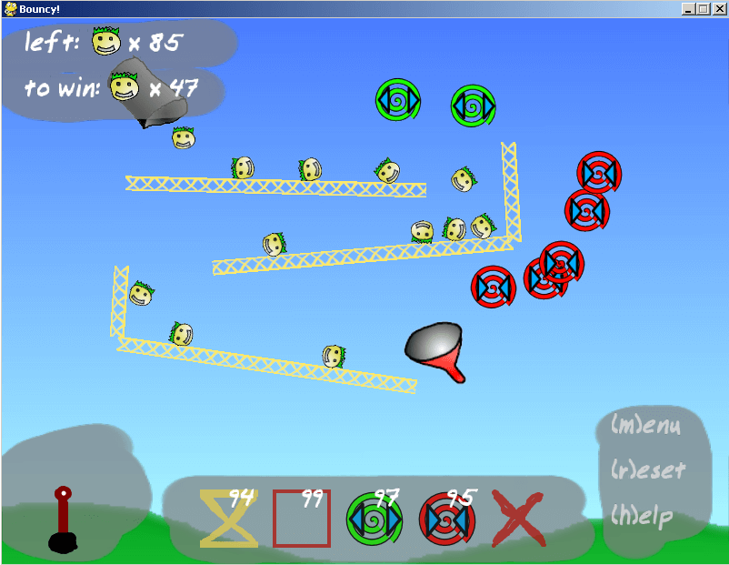
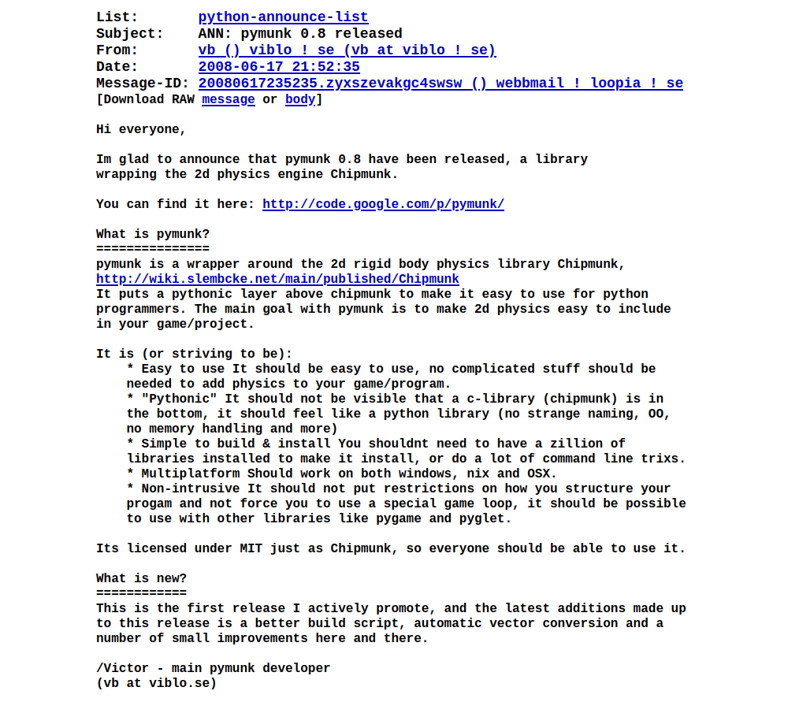

History
=======

This is a writeup of the first 18 years of history of Pymunk. Its adapted from the talk
`18 Years of Falling Objects: Lessons from Maintaining Physics Library
Pymunk<https://www.viblo.se/talks/>` at `Pycon Sweden 2025<https://pycon.se/>`.

2007-08-01
----------

Pymunk was created in 2007. I (Victor) wanted to make a game with realistic 2d physics
for the bi-annual game competition `PyWeek<https://pyweek.org/>` where you have to write
a game from scratch using Python in a week. However, at that time no good 2d physics
library for Python existed, and I did not want to write any advanced physics algorithms
as part of the competition.

The rules of PyWeek allow for participants to use code written before the competition
starts, as long as the code is packaged up as a library that is available for everyone
to use and released at least 1 month before the competition starts. (For the exact
details, see `The PyWeek Rules<https://pyweek.readthedocs.io/en/latest/rules.html>`)

And this is what I did, the first version of Pymunk was hacked together of 5 parts:

- The `Chipmunk2D<https://chipmunk-physics.net/>` C physics library.
- A `2D Vector class<https://www.pygame.org/wiki/2DVectorClass>` from Pygame website.
- Generated ctypes bindings to Chipmunk2D.
- Around 100 lines of actual manually written code.
- A Readme.

And then released as `Pymunk 0.1<https://pyweek.org/e/Bouncy/>` at 2007-08-01 20:35.

1 month and 9 days later
------------------------

Me and a friend, Srekel, wrote the first game using Pymunk in a week, and uploaded it as
our entry into Pyweek 5. The game is called Bouncy, and is a 2D physics driven puzzle
game.

The goal of the game is to get a number of bouncy "heads", that spawn from a metal pipe
in the top left corner of the screen, to the funnel at the other end of each level. You
do this by strategically placing the different objects that can guide the balls in
various ways.

1 year later
------------

After about a year Pymunk was more polished than its initial 0.1 release, and I posted a
release announcement to the python-announce mailing list.

At this time more things were into place, notably the Pymunk vision, :ref:`Main
<index>`. As seen in in the announcement above it more or less match todays (2025)
vision, just worded slightly differntly.

2010 - Pymunk 1.0
-----------------

Finally in 2010, 3 years after the initial release, Pymunk 1.0 were released. The big
new feature motivating a 1.0 release was Python 3 support.

In contrast to many other projects upgrading Pymunk to support Python 3 was not that
complicated. I opted for simulatenouly supporting both 2 and 3 at the same time, which
turns out to be the right choice for Pymunk.
