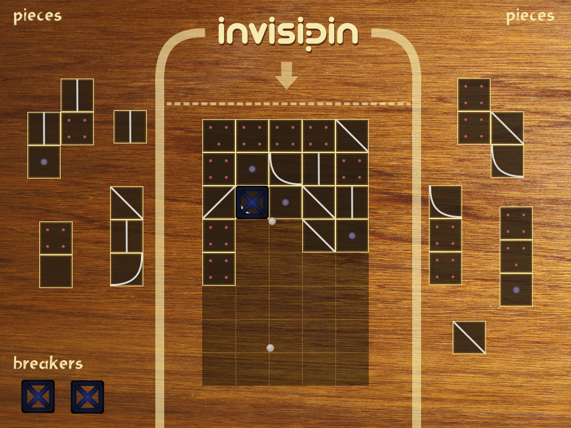
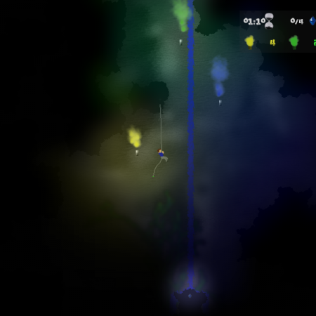

********
Showcase 
********

This page shows some uses of Pymunk. If you also have done something using 
Pymunk please let us know and we can add it here!   

Games
=====

invisipin
---------

  

Winner of PyWeek 20 (Overall Individual Entry)
https://pyweek.org/e/Tee-py20/

SubTerrex
---------

  

"A cave exploration game where you explore caves by descending into them on ropes."
http://www.pygame.org/project-SubTerrex-2389-.html

Papers / Science
================

Pymunk has been used or referenced in a number of scientific papers 

* Amos, Martyn, et al. 
  "Bacterial computing with engineered populations." 
  *Phil. Trans. R. Soc. A* 373.2046 (2015): 20140218.

* Crane, Beth, and Stephen Sherratt. 
  "rUNSWift 2D Simulator; Behavioural Simulation Integrated with the rUNSWift Architecture." 
  *UNSW School of Computer Science and Engineering* (2013).

* Miller, Chreston Allen. 
  "Structural model discovery in temporal event data streams."
  Diss. Virginia Polytechnic Institute and State University, 2013.

* Pumar García, César. 
  "Simulación de evolución dirigida de bacteriófagos en poblaciones de bacterias en 2D." 
  (2013).

* Simoes, Manuel, and Caroline GL Cao. 
  "Leonardo: a first step towards an interactive decision aid for port-placement in robotic surgery." 
  *Systems, Man, and Cybernetics (SMC), 2013 IEEE International Conference on.* IEEE, 2013.

* Goni-Moreno, Angel, and Martyn Amos. 
  "Discrete modelling of bacterial conjugation dynamics." *arXiv preprint arXiv:1211.1146* (2012).

* Matthews, Elizabeth A. 
  "ATLAS CHRONICLE: A STORY-DRIVEN SYSTEM TO CREATE STORY-DRIVEN MAPS."
  Diss. Clemson University, 2012.

* Matthews, Elizabeth, and Brian Malloy. 
  "Procedural generation of story-driven maps." 
  *Computer Games (CGAMES), 2011 16th International Conference on.* IEEE, 2011.

* Miller, Chreston, and Francis Quek. 
  "Toward multimodal situated analysis." 
  *Proceedings of the 13th international conference on multimodal interfaces.* ACM, 2011.

* Verdie, Yannick. 
  "Surface gesture & object tracking on tabletop devices."
  Diss. Virginia Polytechnic Institute and State University, 2010.

* Goni-Moreno, Angel, and Martyn Amos. 
  "DiSCUS: A Simulation Platform for Conjugation Computing." (2000).

* Agrawal, Vivek, and Ryan Kerwin. 
  "Dynamic Robot Path Planning Among Crowds in Emergency Situations."

  
List last updated 2016-01-25. If something is missing or wrong, please contact us!
